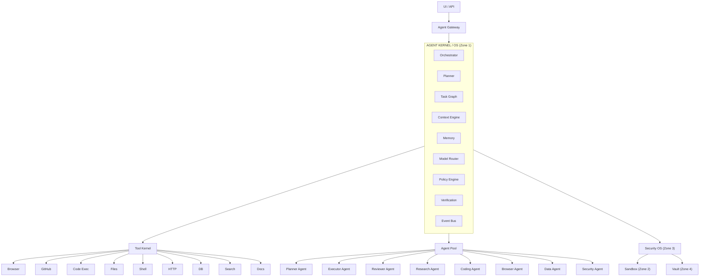
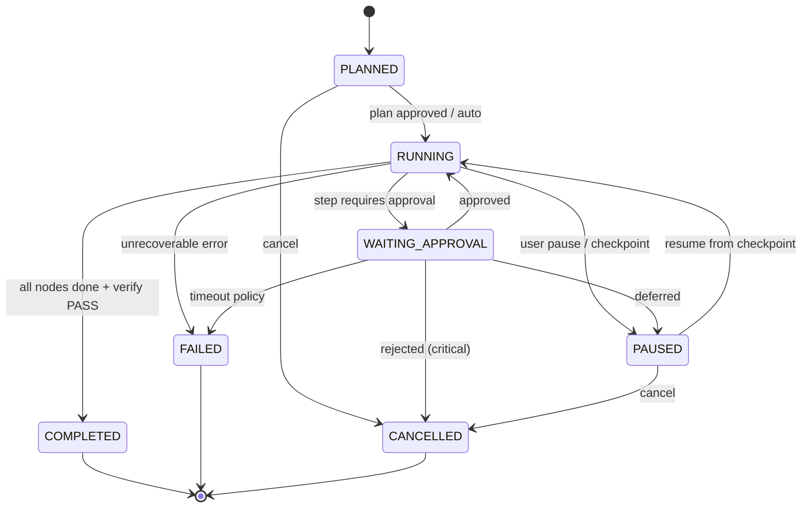
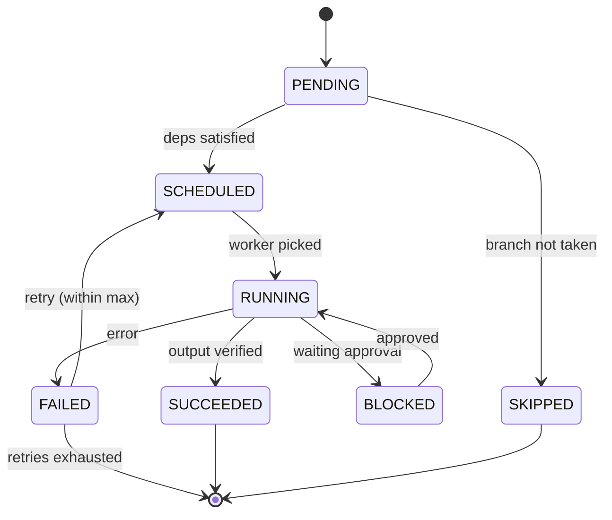
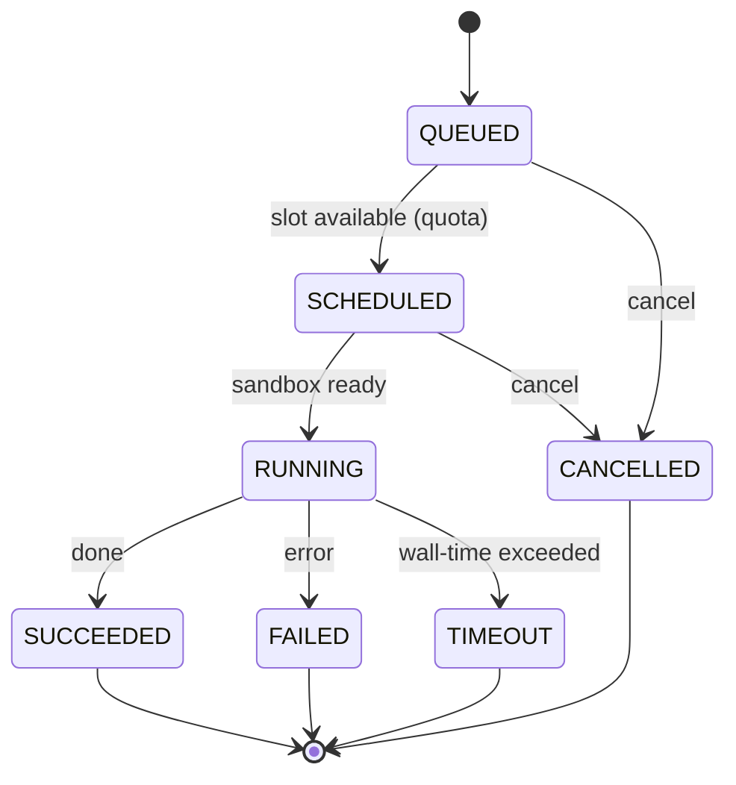
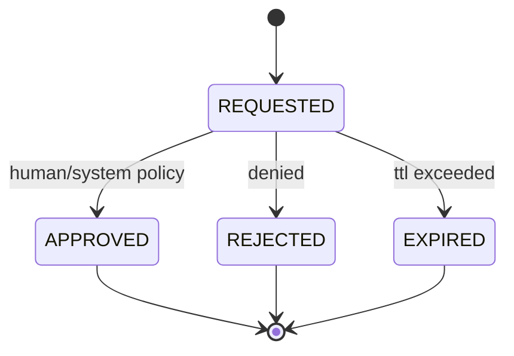
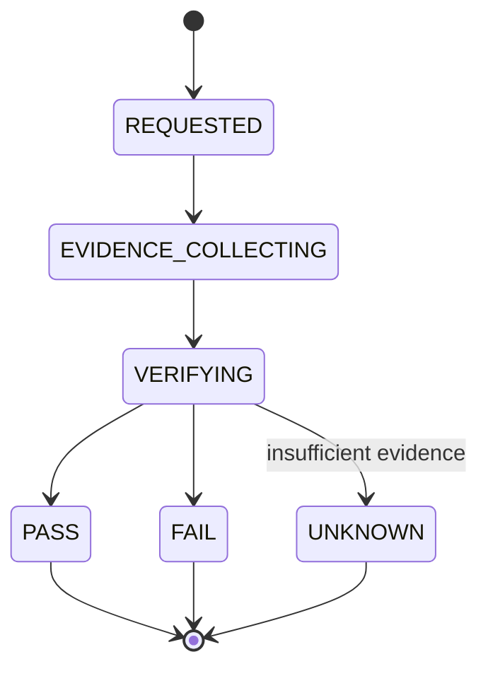
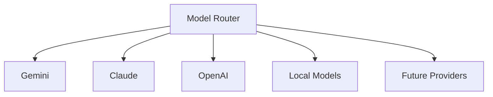
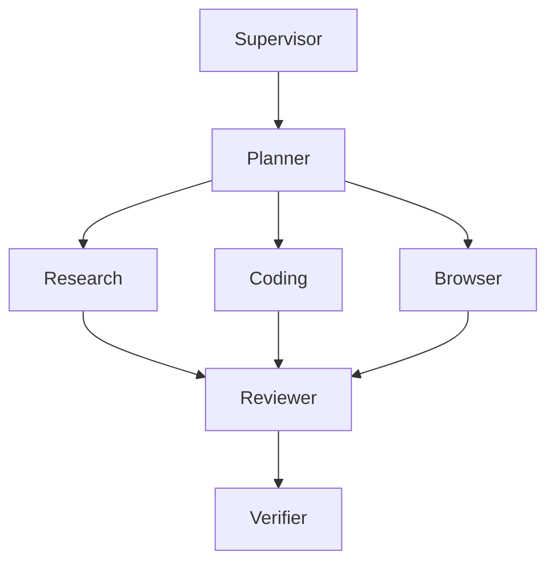

# Architecture Contract v1 — Agent Operating Kernel (AOK)

> **المستند المرجعي الوحيد (Single Source of Truth)** للبنية قبل بدء التنفيذ.
> أي كود يُكتب يجب أن يلتزم بالعقود المعرّفة هنا، وأي انحراف يتطلب تحديث هذا المستند أولًا.

> **⚠️ تحديث v2:** القرارات الهندسية الملزمة (النوع، الأمان، الـLedger، آلات الحالة،
> الـVertical Slice…) انتقلت إلى **[الدستور الهندسي](architecture/CONSTITUTION.md)** و**[سجل الـADRs](architecture/ADRs/)**.
> هذا المستند يبقى المرجع التفصيلي للعقود والـAPIs والـState Machines. عند التعارض، **الدستور هو الأعلى مرتبة**.

| البند | القيمة |
|---|---|
| **الاسم الرمزي** | AOK — Agent Operating Kernel |
| **الإصدار** | `v1.0.0-draft` |
| **الحالة** | `FOR_REVIEW` |
| **التاريخ** | 2026-09-06 |
| **الفرع** | `arena/01a078d5-chat-ai` |
| **المرجع التنافسي** | Manus (agentic execution) + Claude (reasoning/context/tools) |
| **اللغة** | TypeScript (control plane) — النصوص عربية، العقود والرموز إنجليزية |

---

## جدول المحتويات

1. [الهدف والنطاق](#1-الهدف-والنطاق)
2. [مبادئ التصميم والثوابت](#2-مبادئ-التصميم-والثوابت-design-invariants)
3. [نظرة عامة على النظام](#3-نظرة-عامة-على-النظام)
4. [جرد الخدمات](#4-جرد-الخدمات-service-inventory)
5. [نموذج المجال الأساسي والمخططات](#5-نموذج-المجال-الأساسي-والمخططات)
6. [آلات الحالة](#6-آلات-الحالة-state-machines)
7. [Kernel / Runtime](#7-kernel--runtime)
8. [Agent Orchestrator](#8-agent-orchestrator)
9. [Model Router](#9-model-router)
10. [Tool Kernel](#10-tool-kernel)
11. [Security Kernel](#11-security-kernel)
12. [Memory Engine](#12-memory-engine)
13. [Context Engine](#13-context-engine)
14. [Knowledge / RAG Layer](#14-knowledge--rag-layer)
15. [Execution Ledger](#15-execution-ledger)
16. [Verification Engine](#16-verification-engine)
17. [Computer-Use Layer](#17-computer-use-layer)
18. [Artifact System](#18-artifact-system)
19. [Multi-Agent Collaboration](#19-multi-agent-collaboration)
20. [Workflow Engine](#20-workflow-engine)
21. [Human-in-the-Loop](#21-human-in-the-loop)
22. [Event Bus](#22-event-bus)
23. [UI / API و Agent Gateway](#23-ui--api-و-agent-gateway)
24. [الحدود الأمنية](#24-الحدود-الأمنية-security-boundaries)
25. [مرجع الـAPIs الموحّد](#25-مرجع-الـapis-الموحّد)
26. [مراحل MVP](#26-مراحل-mvp)
27. [معيار القبول النهائي](#27-معيار-القبول-النهائي-definition-of-done)
28. [غير الأهداف](#28-غير-الأهداف-non-goals)
29. [قرارات مفتوحة](#29-قرارات-مفتوحة-open-questions)

---

## 1. الهدف والنطاق

بناء **نظام تشغيل للوكلاء** (Agent Operating Kernel) وليس مجرد Chatbot أو Agent واحد، عبر الفصل الصارم بين:

- **التفكير** (Reasoning) — عبر Model Router.
- **التنفيذ** (Execution) — عبر Kernel/Task Engine.
- **الأدوات** (Tools) — عبر Tool Kernel.
- **الذاكرة** (Memory) — عبر Memory/Context Engine.
- **الأمان** (Security) — عبر Security Kernel.
- **التحقق** (Verification) — عبر Verification Engine.

**المعيار الحقيقي للنجاح** هو تنفيذ السيناريو الآتي **مع** الاستئناف بعد الفشل، والتحكم بالصلاحيات، وسجل تدقيق كامل، وتحقق مستقل من النتيجة:

> "خذ هذا المستودع، افهمه، أنشئ خطة، عدّل الكود، شغّل الاختبارات، أصلح الأخطاء، أنشئ Commit/PR، انشره، ثم أثبت لي بالأدلة أن النشر ناجح."

---

## 2. مبادئ التصميم والثوابت (Design Invariants)

هذه الثوابت غير قابلة للتفاوض، وأي كود يخالفها يُرفض في المراجعة:

| # | الثابت (Invariant) | الوصف |
|---|---|---|
| **INV-1** | الـKernel لا يعرف الـAgent | لا يوجد أي `if (agent.type === 'planner')` داخل النواة. الـAgent هو **Plugin/Runtime Component** يُسجَّل في Agent Registry. |
| **INV-2** | كل فعل هو حدث | أي تأثير جانبي (tool, approval, artifact, state change) يُسجَّل في Execution Ledger **قبل** وبعد التنفيذ. |
| **INV-3** | لا تنفيذ بدون عقد | أي أداة أو Agent أو Model تُنفَّذ فقط عبر عقد مُسجَّل (ToolContract / AgentContract / ModelContract). |
| **INV-4** | لا صلاحيات مطلقة | الـAgent لا يحصل على صلاحيات النظام أبدًا؛ يطلب Capability تُمنَح بشرط (Approval Gate). |
| **INV-5** | "تم" لا تكفي | أي ادعاء إنجاز (Claim) يجب أن يمر عبر Verification → PASS/FAIL/UNKNOWN مع Evidence. |
| **INV-6** | قابل للاستئناف | كل خطوة تقبل Checkpoint؛ بعد أي انقطاع يُستأنَف التنفيذ من آخر Checkpoint دون تكرار (Idempotency). |
| **INV-7** | نموذج-محايد | لا يعتمد النظام على مزوّد واحد؛ الـModel Router هو نقطة الوصول الوحيدة لأي LLM. |
| **INV-8** | عزل التنفيذ | أي كود/أداة غير موثوقة تعمل داخل Sandbox منفصل، وليس في عملية الـKernel. |

---

## 3. نظرة عامة على النظام



**طبقات الثقة (Trust Zones):**

| Zone | المكوّنات | القيود |
|---|---|---|
| **Z0 — Control Plane** | Agent Gateway, UI | نقطة الدخول الوحيدة للمستخدم |
| **Z1 — Kernel** | Orchestrator, Planner, Context, Memory, Router, Ledger, Verification | لا Egress للخارج إلا عبر سياسة؛ لا تنفيذ كود عشوائي |
| **Z2 — Sandbox** | أدوات التنفيذ (code/shell/browser) | عملية معزولة، شبكة مقيدة، FS معزول، quotas |
| **Z3 — Vault** | Credential Vault, الأسرار | لا شبكة، لا وصول مباشر للـAgent؛ عبر Broker فقط |
| **Z4 — External** | GitHub, Cloud, Model providers | وصول عبر Allowlist فقط |

---

## 4. جرد الخدمات (Service Inventory)

| الخدمة | المسؤولية | الحدود (ما لا تفعله) |
|---|---|---|
| **Agent Gateway** | مصادقة، جلسات، توجيه الطلبات، WebSocket للبث | لا منطق تنفيذ، لا قرارات |
| **Kernel Runtime** | محرك تنفيذ مبني على الأحداث، Task Graph/DAG، Scheduler، Queue، Checkpoint/Resume، Idempotency | لا معرفة بأدوات أو نماذج محددة |
| **Orchestrator** | إدارة دورة حياة الوكلاء، تفويض المهام، التنسيق متعدد الوكلاء | لا ينفّذ الأدوات بنفسه |
| **Planner** | توليد خطة (Task Graph) من الهدف | لا تنفيذ |
| **Model Router** | اختيار النموذج، routing، fallback، retry، streaming، structured output | لا يعرف منطق الأعمال |
| **Tool Kernel** | Tool Registry، فرض العقود، توجيه الاستدعاء للـSandbox | لا يثق بالأداة |
| **Security Kernel / Policy Engine** | Capabilities، allowlists، Approval Gates، vault، quotas، egress، audit | لا يسمح بأي تجاوز |
| **Memory Engine** | تخزين/استرجاع/ضغط/انتهاء كل أنواع الذاكرة | لا يعالج سياقًا خارج العقود |
| **Context Engine** | تجميع السياق، الميزانية، التقليم، تحديد ما يحتاجه النموذج الآن | لا يخمّن من فراغ — كله من Ledger/Memory |
| **Knowledge / RAG** | ingestion، chunking، embeddings، hybrid search، rerank، citations | لا يولّد إجابات — يعيد المصادر |
| **Execution Ledger** | سجل أحداث append-only، hash chain، replay، forensics | لا يُعدَّل ولا يُحذف |
| **Verification Engine** | تحويل Claim إلى Evidence → Verdict | لا يصدّق كلام الـAgent |
| **Artifact Store** | نسخ/تجزئة/provenance لكل مخرَج | لا يقرر صحّة المخرَج (هذا دور Verification) |
| **Workflow Engine** | تشغيل سير عمل (branching, loops, approval) فوق الـKernel | لا يستبدل الـKernel |
| **Computer-Use Layer** | observe/understand/plan/act/verify/recover للشاشة والمتصفح والطرفية | كل خطوة تمر عبر Security |
| **Agent Pool / Registry** | تسجيل الوكلاء كـplugins، قدراتهم، حدودهم | لا تنفيذ مركزي |

---

## 5. نموذج المجال الأساسي والمخططات

### 5.1 الأنواع الأساسية

```ts
type ULID = string;                 // معرفات مرتّبة زمنيًا
type ActorId = string;              // user | system | agent:<id> | tool:<id>
type Capability = string;           // e.g. 'fs:read:/workspace/**'
type Hash = string;                 // sha256 hex

interface ActorRef {
  type: 'user' | 'system' | 'agent' | 'tool';
  id: ActorId;
}

interface Timestamps {
  created: string;                  // ISO-8601
  started?: string;
  updated?: string;
  completed?: string;
}
```

### 5.2 Task

```ts
type TaskState =
  | 'PLANNED' | 'RUNNING' | 'WAITING_APPROVAL'
  | 'PAUSED' | 'COMPLETED' | 'FAILED' | 'CANCELLED';

interface Task {
  id: ULID;
  runId: ULID;                      // تجميع الجلسة
  parentTaskId?: ULID;
  goal: string;
  state: TaskState;
  plan: PlanNode[];                  // Task Graph (DAG)
  contextRef: ULID;                  // لقطة السياق المجمّع
  assignedAgent?: ActorId;
  constraints: Constraints;
  checkpoints: Checkpoint[];
  createdBy: ActorRef;
  timestamps: Timestamps;
}

interface Constraints {
  maxSteps: number;
  maxBudgetUsd: number;
  maxWallTimeMs: number;
  allowedCapabilities: Capability[];
  approvalMode: 'MANUAL' | 'ASSISTED' | 'AUTONOMOUS';
}

interface Checkpoint {
  id: ULID;
  taskId: ULID;
  nodeId: ULID;                     // آخر عقدة مكتملة
  stateSnapshotHash: Hash;           // تجزئة حالة العقد
  memorySnapshotRef: ULID;
  ledgerPosition: ULID;              // آخر حدث
  savedAt: string;
}
```

### 5.3 Task Graph (DAG)

```ts
type NodeType =
  | 'RESEARCH' | 'CODE' | 'BROWSER' | 'TOOL'
  | 'REVIEW' | 'VERIFY' | 'APPROVE' | 'SUBTASK';

interface PlanNode {
  id: ULID;
  type: NodeType;
  deps: ULID[];                     // حواف DAG
  agentRole: AgentRole;
  instructions: string;
  toolIds: string[];                // الأدوات المسموحة لهذه العقدة فقط
  expectedArtifacts: string[];      // artifact kinds المتوقعة
  approvalRequired: boolean;
  timeoutMs: number;
  retry: { max: number; backoff: 'fixed' | 'exponential'; baseMs: number };
}
```

### 5.4 Execution Ledger Event (المظروف الموحّد)

```ts
type EventType =
  | 'RunCreated' | 'TaskCreated' | 'PlanGenerated' | 'TaskStarted'
  | 'ToolRequested' | 'ApprovalRequested' | 'ApprovalDecided'
  | 'ToolExecuted' | 'ArtifactCreated' | 'TestExecuted'
  | 'CheckpointSaved' | 'TaskPaused' | 'TaskResumed'
  | 'ReviewCompleted' | 'VerificationCompleted'
  | 'TaskCompleted' | 'TaskFailed' | 'TaskCancelled';

interface LedgerEvent<T = unknown> {
  eventId: ULID;
  seq: number;                      // رقم تسلسلي رتيب داخل الـRun
  type: EventType;
  actor: ActorRef;
  runId: ULID;
  taskId?: ULID;
  timestamp: string;
  inputHash: Hash;                  // تجزئة المدخلات المُطبَّعة (canonical)
  outputHash?: Hash;
  tool?: string;                    // ToolContract.name
  permission?: Capability;
  result?: T;
  evidence?: EvidenceRef[];
  prevEventHash?: Hash;             // سلسلة تجزئة لمنع العبث (tamper-evident)
}

interface EvidenceRef {
  evidenceId: ULID;
  kind: EvidenceKind;
  hash: Hash;
}
```

### 5.5 Artifact

```ts
type ArtifactKind =
  | 'code' | 'document' | 'image' | 'dataset'
  | 'build' | 'deployment' | 'evidence';

interface Artifact {
  id: ULID;
  kind: ArtifactKind;
  taskId: ULID;
  creator: ActorRef;
  version: number;
  checksum: Hash;                   // sha256
  storageRef: string;               // object storage path
  provenance: ULID[];               // سلسلة artifact/event السابقة
  verificationStatus: 'PENDING' | 'PASS' | 'FAIL' | 'UNKNOWN';
  timestamps: Timestamps;
}
```

### 5.6 Memory Record

```ts
type MemoryKind =
  | 'working' | 'episodic' | 'semantic'
  | 'project' | 'preference' | 'knowledge';

interface MemoryRecord {
  id: ULID;
  kind: MemoryKind;
  content: unknown;
  embedding?: number[];
  metadata: {
    source: string;                 // provenance
    confidence: number;             // 0..1
    score: number;                  // relevance/importance
    tags: string[];
  };
  projectId?: ULID;
  userId?: string;
  expiresAt?: string;               // Expiration
  timestamps: Timestamps;
}
```

### 5.7 Verification (Claim → Evidence → Verdict)

```ts
type EvidenceKind =
  | 'git_commit' | 'ci_status' | 'http_check' | 'test_result'
  | 'file' | 'log' | 'screenshot' | 'artifact';

type Verdict = 'PASS' | 'FAIL' | 'UNKNOWN';

interface Claim {
  id: ULID;
  taskId: ULID;
  statement: string;                // "تم نشر المشروع"
  madeBy: ActorRef;
  at: string;
}

interface Evidence {
  id: ULID;
  claimId: ULID;
  kind: EvidenceKind;
  ref: string;                      // URL/commit/object path
  hash: Hash;
  collectedBy: ActorRef;
  collectedAt: string;
}

interface Verification {
  id: ULID;
  claimId: ULID;
  evidenceIds: ULID[];
  verdict: Verdict;
  confidence: number;               // 0..1
  reasoning: string;
  verifiedBy: ActorRef | 'system';
  at: string;
}
```

---

## 6. آلات الحالة (State Machines)

### 6.1 Task Lifecycle



**جدول الانتقالات الرسمي (State Transition Table):**

| من | إلى | الشرط / الحدث |
|---|---|---|
| PLANNED | RUNNING | `PlanApproved` أو وضع AUTONOMOUS |
| PLANNED | CANCELLED | `CancelRequested` |
| RUNNING | WAITING_APPROVAL | عقدة تطلب `approvalRequired=true` |
| RUNNING | PAUSED | `PauseRequested` أو Checkpoint دوري |
| RUNNING | COMPLETED | كل العقد `SUCCEEDED` + Verification PASS |
| RUNNING | FAILED | خطأ غير قابل للاسترداد أو استنفاد retries |
| WAITING_APPROVAL | RUNNING | `ApprovalDecided(APPROVED)` |
| WAITING_APPROVAL | PAUSED | `ApprovalDecided(DEFER)` |
| WAITING_APPROVAL | CANCELLED | `ApprovalDecided(REJECTED)` على عقدة حرجة |
| WAITING_APPROVAL | FAILED | تجاوز `approval.ttl` حسب السياسة |
| PAUSED | RUNNING | `ResumeRequested` (من آخر Checkpoint) |
| PAUSED | CANCELLED | `CancelRequested` |

### 6.2 Node State (داخل الـTask Graph)



### 6.3 Job (Scheduler)



### 6.4 Approval



### 6.5 Verification



---

## 7. Kernel / Runtime

### 7.1 العقد (Interface)

```ts
interface KernelRuntime {
  createRun(req: CreateRunRequest): Promise<Run>;
  submitTask(task: Task): Promise<TaskId>;
  submitPlan(plan: PlanNode[]): Promise<void>;      // validate DAG acyclicity
  schedule(): Promise<void>;                        // scheduler tick
  checkpoint(taskId: ULID): Promise<Checkpoint>;
  resume(runId: ULID): Promise<Task>;               // from last checkpoint
  pause(taskId: ULID): Promise<void>;
  cancel(taskId: ULID, reason: string): Promise<void>;
  onEvent(handler: (e: LedgerEvent) => void): void; // event-driven
}

interface Run {
  id: ULID;
  userId: string;
  approvalMode: 'MANUAL' | 'ASSISTED' | 'AUTONOMOUS';
  state: 'ACTIVE' | 'COMPLETED' | 'FAILED';
  quotas: Quotas;
}

interface Quotas {
  maxConcurrentJobs: number;
  maxWallTimeMs: number;
  maxBudgetUsd: number;
  maxEgressBytes: number;
}
```

### 7.2 ضمانات التنفيذ

- **Idempotency:** كل ToolExecution يحمل `executionKey = hash(taskId + nodeId + attempt)`؛ إعادة التنفيذ لنفس المفتاح تُعيد النتيجة المخزّنة ولا تعيد الأثر الجانبي.
- **Checkpoint/Resume:** بعد كل عقدة ناجحة يُكتب Checkpoint؛ عند `resume` تُعاد العقد غير المكتملة فقط.
- **Isolation:** كل Job يعمل في Sandbox (Zone 2) منفصل.
- **DAG validation:** رفض الخطط الدائرية (cycle detection) قبل الجدولة.

---

## 8. Agent Orchestrator

### 8.1 الـAgent كـPlugin (اللا-ثابت INV-1)

```ts
interface AgentContract {
  name: string;                     // unique
  version: string;                  // semver
  roles: AgentRole[];               // PLANNER | EXECUTOR | REVIEWER | ...
  capabilities: Capability[];       // الصلاحيات القصوى الممكنة
  inputSchema: JSONSchema;
  outputSchema: JSONSchema;
  modelRequirements: { minContextTokens: number; preferredCapabilities: string[] };
  run(ctx: AgentContext): Promise<AgentResult>;
}

type AgentRole =
  | 'PLANNER' | 'EXECUTOR' | 'REVIEWER' | 'CRITIC'
  | 'RESEARCH' | 'CODING' | 'BROWSER' | 'COMPUTER_USE'
  | 'DATA' | 'DOCUMENT' | 'SECURITY' | 'VERIFIER' | 'SUPERVISOR';

interface AgentContext {
  taskId: ULID;
  nodeId: ULID;
  context: ContextAssembly;         // من Context Engine
  tools: string[];                  // ToolContracts المسموحة للعقدة
  memory: MemoryFacade;
  router: ModelRouter;
  ledger: LedgerWriter;
}

interface AgentResult {
  status: 'SUCCEEDED' | 'FAILED' | 'NEEDS_APPROVAL' | 'DELEGATED';
  artifacts: ArtifactRef[];
  claims: Claim[];
  handoff?: { to: AgentRole; message: string };
}
```

### 8.2 التسجيل الديناميكي

```ts
interface AgentRegistry {
  register(contract: AgentContract): Promise<void>;
  unregister(name: string): Promise<void>;
  resolve(role: AgentRole): AgentContract;
  list(): AgentContract[];
}
```

> إضافة Agent جديدة = `registry.register(...)` فقط. **لا تعديل على الـKernel.**

---

## 9. Model Router

### 9.1 طبقة المزوّدين الموحّدة



### 9.2 العقد (Interface)

```ts
interface ModelProvider {
  id: string;                       // 'gemini' | 'claude' | 'openai' | 'local' | ...
  capabilities: ModelCapability[];  // completion | vision | tool_use | computer_use | embedding | audio
  models: ModelInfo[];
  invoke(req: ModelRequest): Promise<ModelResponse>;
  stream(req: ModelRequest): AsyncIterable<ModelChunk>;
}

interface ModelInfo {
  id: string;
  contextWindow: number;
  maxOutputTokens: number;
  supportsStructuredOutput: boolean;
  supportsTools: boolean;
  pricingPer1k?: { inputUsd: number; outputUsd: number };
}

interface ModelRequest {
  taskType: TaskTypeHint;           // routing hint
  messages: Message[];
  tools?: ToolSchema[];
  responseFormat?: 'text' | 'json_schema' | 'tool_call';
  budget: { maxTokens: number; maxCostUsd: number; deadlineMs: number };
  contextRef: ULID;
}

interface ModelResponse {
  providerId: string;
  modelId: string;
  content: string;
  toolCalls?: ToolCall[];
  structured?: unknown;
  usage: { inputTokens: number; outputTokens: number; costUsd: number };
  latencyMs: number;
}
```

### 9.3 سياسة التوجيه

```ts
interface RoutingPolicy {
  taskType: TaskTypeHint;
  preferences: string[];            // ترتيب المزوّدين
  constraints: { maxLatencyMs?: number; maxCostUsd?: number };
  fallbacks: string[];              // ترتيب fallback
  retry: { maxAttempts: number; onErrors: string[] };
}

type TaskTypeHint =
  | 'planning' | 'coding' | 'review' | 'research'
  | 'summarization' | 'extraction' | 'vision' | 'embedding';
```

**سلوكيات إلزامية:**

- **Fallback:** فشل/انتهاء مهلة المزوّد الأول → التالي فورًا.
- **Retry:** أخطاء `429/5xx/rate_limit/context_length` فقط.
- **Context budgeting:** حساب توكنات كل قسم قبل الإرسال (بالاشتراك مع Context Engine).
- **Structured output:** فرض schema عبر `json_schema` أو دالة تحقق لاحقة.
- **Streaming:** موحّد عبر `AsyncIterable<ModelChunk>` لكل المزوّدين.
- **Discovery:** `GET /models` يعرض القدرات الفعلية لكل مزوّد.

---

## 10. Tool Kernel

### 10.1 العقد الرسمي للأداة (JSON Schema)

```json
{
  "name": "github.create_pull_request",
  "version": "1.0.0",
  "input_schema": {
    "type": "object",
    "required": ["repo", "base", "head", "title"],
    "properties": {
      "repo":  { "type": "string" },
      "base":  { "type": "string" },
      "head":  { "type": "string" },
      "title": { "type": "string" },
      "body":  { "type": "string" }
    }
  },
  "output_schema": {
    "type": "object",
    "required": ["pr_url"],
    "properties": { "pr_url": { "type": "string", "format": "uri" } }
  },
  "permissions": ["github:repo:write"],
  "risk_level": "HIGH",
  "timeout": "60s",
  "sandbox_policy": "network-restricted",
  "audit_policy": "full"
}
```

```ts
type RiskLevel = 'LOW' | 'MEDIUM' | 'HIGH' | 'CRITICAL';

interface ToolContract {
  name: string;
  version: string;
  inputSchema: JSONSchema;
  outputSchema: JSONSchema;
  permissions: Capability[];
  riskLevel: RiskLevel;
  timeout: string;                  // ISO-8601 duration
  sandboxPolicy: 'none' | 'network-restricted' | 'full-isolation';
  auditPolicy: 'off' | 'summary' | 'full';
}

interface ToolHandler {
  execute(input: unknown, ctx: ToolExecutionContext): Promise<unknown>;
}
```

### 10.2 كتالوج الأدوات الأولية

| الأداة | الـCapability | الـRisk | الـSandbox |
|---|---|---|---|
| `github.*` (commit, pr, branch) | `github:repo:read/write` | HIGH | network-restricted |
| `browser.*` (navigate, click, extract) | `browser:web:*` | MEDIUM | full-isolation |
| `files.*` (read, write, edit, diff) | `fs:read/write:<scope>` | LOW | workspace-only |
| `shell.run` | `shell:exec:<scope>` | CRITICAL | full-isolation |
| `http.request` | `net:egress:<domain>` | MEDIUM | network-restricted |
| `database.query` | `db:query:<scope>` | HIGH | network-restricted |
| `cloud.deploy` | `cloud:deploy:<scope>` | CRITICAL | approval-always |
| `search.web` | `net:egress:search` | LOW | network-restricted |
| `documents.*` (parse, extract) | `fs:read:<scope>` | LOW | workspace-only |
| `code.exec` | `code:exec:<sandbox>` | CRITICAL | full-isolation |

### 10.3 Tool Registry

```ts
interface ToolRegistry {
  register(contract: ToolContract, handler: ToolHandler): Promise<void>;
  unregister(name: string): Promise<void>;
  resolve(name: string, version?: string): { contract: ToolContract; handler: ToolHandler };
  list(): ToolContract[];
  validateInput(name: string, input: unknown): Promise<unknown>;  // against input_schema
}
```

> **قاعدة:** أي استدعاء أداة يمر عبر Security Kernel للتحقق من الـCapability **قبل** الوصول للـhandler.

---

## 11. Security Kernel

### 11.1 نموذج الصلاحيات (Capability-Based)

```ts
interface Grant {
  principal: ActorId;               // agent id أو 'user'
  capability: Capability;           // e.g. 'github:repo:write:elazamey/chat.ai'
  scope: string;                    // نمط المورد (glob/pattern)
  effect: 'allow' | 'deny';         // deny له الأسبقية
  conditions: {
    approval: 'always' | 'never' | 'per-run';
    budgetUsd?: number;
    rateLimit?: { perMin: number };
  };
  expiresAt?: string;
}
```

**أمثلة Capabilities:**

```text
fs:read:/workspace/**
fs:write:/workspace/**
shell:exec:/workspace/**
net:egress:api.github.com
github:repo:write:elazamey/chat.ai
browser:web:*:readonly
cloud:deploy:production
credential:rotate:github-token
```

### 11.2 Approval Gates

| الفعل | الوضع الافتراضي |
|---|---|
| قراءة ملفات | تلقائي |
| تعديل كود | تلقائي |
| تشغيل الاختبارات | تلقائي |
| إنشاء Commit/PR | تلقائي (per-run) |
| حذف إنتاج | **موافقة** |
| نشر إنتاج | **موافقة** |
| تدوير أسرار | **موافقة** |
| أي أداة `CRITICAL` | **موافقة** |

```ts
interface ApprovalRequest {
  id: ULID;
  kind: 'tool' | 'action' | 'deploy' | 'credential' | 'egress';
  requestedBy: ActorRef;
  capability: Capability;
  target: { tool?: string; input?: unknown; action?: string };
  riskLevel: RiskLevel;
  justification: string;
  state: 'REQUESTED' | 'APPROVED' | 'REJECTED' | 'EXPIRED';
  ttl: string;
  decidedBy?: ActorRef;
  decidedAt?: string;
}
```

### 11.3 الضوابط الإلزامية

| الضابط | الوصف |
|---|---|
| **Allowlist repos/domains/tools** | أي repo/domain/tool غير مدرج = مرفوض افتراضيًا |
| **Secret isolation** | الأسرار لا تدخل الـContext أبدًا؛ تُحقن عبر Broker وقت التنفيذ فقط |
| **Credential Vault** | تشفير at-rest، تدوير، لا وصول مباشر للـAgent |
| **Sandbox execution** | كل كود/أداة غير موثوقة داخل Zone 2 |
| **Network egress control** | egress عبر proxy يفرض الـallowlist |
| **Workspace isolation** | كل Run له workspace منفصل |
| **Path traversal protection** | حلّ المسارات canonically ورفض الخروج عن الـscope |
| **Command policy** | قائمة أوامر ممنوعة/مقيدة في `shell.run` |
| **Resource quotas** | CPU/ذاكرة/شبكة/وقت/تكلفة لكل Run |
| **Full audit trail** | كل Grant/Approval/Deny في الـLedger |

---

## 12. Memory Engine

### 12.1 الأنواع

```text
Memory
 ├── Working Memory      (نشطة، مرتبطة بالـRun الحالي)
 ├── Episodic Memory     (ماذا حدث — تجارب سابقة)
 ├── Semantic Memory     (ماذا نعرف — حقائق مستقرة)
 ├── Project Memory      (حالة المشروع عبر الجلسات)
 ├── User Preferences    (تفضيلات المستخدم)
 └── Long-Term Knowledge (معرفة عامة طويلة الأمد)
```

### 12.2 العقد (Interface)

```ts
interface MemoryFacade {
  write(record: MemoryRecord): Promise<void>;
  search(query: string, opts?: { kind?: MemoryKind; topK?: number; minScore?: number }): Promise<MemoryRecord[]>;
  summarize(kind: MemoryKind, scope: { projectId?: ULID }): Promise<MemoryRecord>; // Context compression
  expire(): Promise<void>;                       // Expiration
  resolveConflict(a: MemoryRecord, b: MemoryRecord): Promise<MemoryRecord>; // Conflict resolution
  forget(id: ULID): Promise<void>;
}
```

### 12.3 السياسات

- **Context compression:** عند تجاوز ميزانية السياق، تُضغط الـWorking Memory إلى ملخص مع Provenance.
- **Memory scoring:** درجة الأهمية = تكرار الوصول × حداثة × ثقة المصدر.
- **Provenance:** كل سجل يذكر مصدره (أي Ledger event أو مستند أنتجته).
- **Expiration:** سجلات Working/Episodic لها TTL؛ Semantic/Knowledge تبقى حتى تُستبدل.
- **Conflict resolution:** عند تعارض سجلين، تفوز الأعلى ثقة والأحدث مصدرًا، ويُحفظ التعارض كسجل جديد.

---

## 13. Context Engine

### 13.1 التركيبة

```ts
interface ContextAssembly {
  system: SystemSection;
  user: UserSection;
  task: TaskSection;
  project: ProjectSection;
  memory: MemorySection[];
  toolState: ToolStateSection;
  files: FileSection[];
  previousActions: LedgerEvent[];   // من Execution Ledger
  constraints: Constraints;
  budget: ContextBudget;            // توزيع التوكنات على الأقسام
}

interface ContextBudget {
  totalTokens: number;              // من ModelInfo.contextWindow
  perSection: Record<SectionName, number>;
  reservedForOutput: number;
}
```

### 13.2 الأسئلة التي يجيب عنها المحرك تلقائيًا

| السؤال | الآلية |
|---|---|
| ماذا يحتاج الآن؟ | تجميع Task + Current Node + أدوات العقدة + آخر أحداث الـLedger |
| ماذا يمكن حذفه؟ | التقليم حسب relevance score + TTL |
| ماذا يجب الاحتفاظ به؟ | Constraints + تفضيلات المستخدم + الأهداف غير المكتملة |
| ما المعلومات الموثوقة؟ | من مصادر Provenance موثوقة فقط (Ledger/Knowledge) |
| ما الذي يحتاج إعادة تحقق؟ | أي Claim حالته UNKNOWN/FAIL |

---

## 14. Knowledge / RAG Layer

```ts
interface KnowledgeEngine {
  ingest(doc: Document, opts?: IngestOptions): Promise<DocumentRef>;  // chunking + embeddings + metadata
  hybridSearch(query: string, opts: SearchOptions): Promise<SearchResult[]>;
  rerank(query: string, candidates: SearchResult[]): Promise<SearchResult[]>;
  getSource(ref: string): Promise<SourceRecord>;                       // للإجابة "من أين جاءت هذه المعلومة؟"
}

interface DocumentRef {
  id: ULID;
  chunks: number;
  embeddingModel: string;
  metadata: Record<string, unknown>;
  provenance: { source: string; ingestedAt: string };
}

interface SearchResult {
  chunkId: ULID;
  documentId: ULID;
  text: string;
  score: number;                    // بعد reranking
  source: SourceRecord;             // citation جاهزة
}
```

**المتطلبات الإلزامية:**

- Hybrid search = Semantic (embeddings) + Keyword (BM25).
- Reranking بعد الجمع.
- **Citations إلزامية:** كل إجابة مستندة لمعلومة من RAG تحمل `SourceRecord` (URL/مستند/سطر).
- الإجابة على "من أين جاءت هذه المعلومة؟" تكون استعلام `getSource` وليس توليدًا.

---

## 15. Execution Ledger

### 15.1 كتالوج الأحداث

```text
RunCreated        TaskCreated      PlanGenerated     TaskStarted
ToolRequested     ApprovalRequested ApprovalDecided   ToolExecuted
ArtifactCreated   TestExecuted     CheckpointSaved   TaskPaused
TaskResumed       ReviewCompleted  VerificationCompleted
TaskCompleted     TaskFailed       TaskCancelled
```

### 15.2 الخصائص

- **Append-only:** لا تعديل ولا حذف؛ أي تصحيح = حدث جديد.
- **Tamper-evident:** `prevEventHash` يربط الأحداث بسلسلة تجزئة.
- **Replay:** إعادة تشغيل أحداث Run بترتيب `seq` لإنتاج نفس الحالة (forensics/debug).
- **Forensics:** `GET /runs/{runId}/events?filter=...` بأي بُعد (actor/tool/permission).

---

## 16. Verification Engine

**بدل "Agent يقول تم"، النظام يقول:**

```text
Claim → Evidence → Verification → PASS / FAIL / UNKNOWN
```

```ts
interface VerificationEngine {
  registerClaim(claim: Claim): Promise<ClaimId>;
  collectEvidence(claimId: ULID, spec: EvidenceSpec): Promise<Evidence[]>;
  verify(claimId: ULID): Promise<Verification>;
  recheck(claimId: ULID): Promise<Verification>;   // "ما الذي يحتاج إعادة تحقق؟"
}

interface EvidenceSpec {
  kinds: EvidenceKind[];            // ما الأدلة المقبولة
  required: EvidenceKind[];         // الأدلة الإلزامية
}
```

**مثال السيناريو الكامل:**

```text
Claim: "تم نشر المشروع"
  ├─ git_commit:   verify commit exists on main          → PASS
  ├─ ci_status:    verify CI pipeline green              → PASS
  ├─ deployment:   verify deployment endpoint responds   → PASS
  └─ health_check: verify /health returns 200            → PASS
                                                        Verdict: PASS
```

---

## 17. Computer-Use Layer

```text
Observe → Understand → Plan → Act → Verify → Recover
```

| القناة | الواجهة | القيد الأمني |
|---|---|---|
| Browser | `browser.*` (DOM, tabs, downloads/uploads, multi-tab) | egress عبر allowlist، عزل لكل جلسة |
| Filesystem | `files.*` داخل workspace فقط | path-traversal protection |
| Terminal | `shell.run` داخل sandbox | command policy + quotas |
| GUI | screenshots + coordinates | تُسجَّل كـEvidence مع hash |
| Screenshots/DOM | `computer.observe` | تُخزَّن في Artifact Store (kind=evidence) |

```ts
interface ComputerUseSession {
  id: ULID;
  channel: 'browser' | 'filesystem' | 'terminal' | 'gui';
  state: 'IDLE' | 'OBSERVING' | 'ACTING' | 'VERIFYING' | 'RECOVERING';
  permissions: Capability[];
}
```

**Recover:** عند فشل خطوة، يعيد النظام `Observe` ويعيد التخطيط المحلي بدل إعادة الـTask كاملًا.

---

## 18. Artifact System

| الخاصية | الوصف |
|---|---|
| Versioning | كل تعديل = إصدار جديد بنفس `id` |
| Provenance | سلسلة `provenance` ترجع للمصدر (task/agent/event) |
| Checksums | `sha256` إلزامي لكل إصدار |
| Parent task | `taskId` إلزامي |
| Creator agent | `creator` إلزامي |
| Verification status | PENDING → PASS/FAIL/UNKNOWN عبر Verification Engine |

---

## 19. Multi-Agent Collaboration



| الآلية | العقد |
|---|---|
| Shared task state | عبر Task Graph + Ledger (لا ذاكرة مشتركة خام) |
| Message passing | `handoff` في `AgentResult` |
| Delegation | عقدة `SUBTASK` تخلق Task فرعي |
| Parallel execution | عقد بلا تبعيات تُجدوَل معًا |
| Agent handoff | `handoff.to` + السياق المجمّع |
| Conflict detection | Reviewer/Verifier يرفعان `ReviewCompleted/VerificationCompleted` بحالة صريحة |

---

## 20. Workflow Engine

```yaml
workflow:
  - research
  - analyze
  - implement
  - test
  - review
  - deploy
  - verify
```

```ts
interface WorkflowStep {
  id: string;
  action: string;                   // أداة/عقدة/سير عمل فرعي
  when?: string;                    // شرط: tests_pass / ci_green / ...
  loop?: { while: string; max: number };
  approval?: 'auto' | 'manual';
}
```

**Branching مثال:**

```yaml
- id: deploy
  when: tests_pass
- id: fix
  when: not tests_pass
```

- يدعم loops وhuman-approval عبر نفس Approval Gates.

---

## 21. Human-in-the-Loop

ثلاثة أوضاع، ليست ثنائية:

| الوضع | السلوك |
|---|---|
| **MANUAL** | كل خطوة تتطلب موافقة |
| **ASSISTED** | تلقائي للأفعال الآمنة (قراءة/تعديل/اختبار) + موافقة للخطرة (حذف/نشر/تدوير أسرار) |
| **AUTONOMOUS** | تلقائي بالكامل ضمن السياسات والـquotas (قابل للتدقيق لاحقًا) |

---

## 22. Event Bus

### 22.1 المواضيع (Topics)

```text
runs.{runId}.state
runs.{runId}.events
runs.{runId}.approvals
tools.{toolName}.executed
artifacts.{taskId}
verification.{taskId}
```

### 22.2 النقل

- داخليًا: in-process bus (Z1).
- خارجيًا (UI): WebSocket عبر Agent Gateway مع اشتراك موثّق.
- كل رسالة = `LedgerEvent` (نفس المظروف) لضمان INV-2.

---

## 23. UI / API و Agent Gateway

- **Agent Gateway** هو نقطة الدخول الوحيدة (REST + WebSocket).
- المصادقة: JWT/API Key على مستوى المستخدم.
- التفويض داخل النظام: Capability-based وليس role-based (INV-4).
- كل طلب/استجابة يُسجَّل في الـLedger.

---

## 24. الحدود الأمنية (Security Boundaries)

```text
┌───────────── Z0: Control Plane ─────────────┐
│  UI / API ── Agent Gateway                   │
└──────────────────┬───────────────────────────┘
                   │ (authn + authz)
┌──────────────────▼──────────── Z1: Kernel ───┐
│ Orchestrator · Planner · Context · Memory     │
│ Router · Ledger · Verification · Event Bus    │
└───────┬────────────────────────────┬──────────┘
        │ (Tool Kernel: enforce contract)      │ (Security Kernel: enforce grants)
┌───────▼────── Z2: Sandbox ────────┐ ┌───────▼────── Z3: Vault ──────┐
│ code.exec · shell.run · browser    │ │ secrets · credentials         │
│ network-restricted · quotas        │ │ no network · broker-only      │
└────────────────────────────────────┘ └────────────────────────────────┘
        │ egress proxy (allowlist)
┌───────▼──────────────── Z4: External ────────┐
│ GitHub · Cloud · Model providers · Search     │
└───────────────────────────────────────────────┘
```

**قواعد العبور:**

- Z1 → Z2: عبر Tool Kernel فقط، وبعد فحص الـCapability.
- Z1 → Z3: لا وصول مباشر؛ الـBroker يحقن السر وقت التنفيذ فقط (لا يظهر في السياق).
- Z2 → Z4: عبر egress proxy يفرض allowlist النطاقات.
- Z0 → Z1: عبر Gateway فقط وبمصادقة.

---

## 25. مرجع الـAPIs الموحّد

الاصطلاح: base path `/api/v1`، JSON، أخطاء موحّدة `{ error: { code, message, details } }`.

### 25.1 Runs & Tasks

| Method | Path | الوصف |
|---|---|---|
| POST | `/runs` | إنشاء Run |
| GET | `/runs/{runId}` | حالة الـRun |
| POST | `/runs/{runId}/resume` | استئناف من آخر Checkpoint |
| POST | `/tasks` | إنشاء Task (مهمة) |
| GET | `/tasks/{taskId}` | حالة الـTask + الخطة |
| POST | `/tasks/{taskId}/pause` | إيقاف مؤقت |
| POST | `/tasks/{taskId}/resume` | استئناف |
| POST | `/tasks/{taskId}/cancel` | إلغاء |

### 25.2 Plan

| Method | Path | الوصف |
|---|---|---|
| POST | `/tasks/{taskId}/plan` | توليد خطة (Planner) |
| GET | `/tasks/{taskId}/plan` | جلب الـTask Graph |

### 25.3 Approvals

| Method | Path | الوصف |
|---|---|---|
| GET | `/approvals?principal=...` | الموافقات المعلّقة |
| POST | `/approvals/{id}/approve` | قبول |
| POST | `/approvals/{id}/reject` | رفض |

### 25.4 Tools

| Method | Path | الوصف |
|---|---|---|
| POST | `/tools` | تسجيل أداة |
| GET | `/tools` | قائمة الأدوات |
| GET | `/tools/{name}` | عقد الأداة |
| DELETE | `/tools/{name}` | إزالة أداة |

### 25.5 Models

| Method | Path | الوصف |
|---|---|---|
| GET | `/models` | اكتشاف القدرات/النماذج |
| POST | `/models/invoke` | استدعاء (routed) |
| POST | `/models/stream` | بث (SSE) |

### 25.6 Memory & Knowledge

| Method | Path | الوصف |
|---|---|---|
| POST | `/memory` | كتابة سجل |
| GET | `/memory/search?q=...&kind=...` | استرجاع |
| DELETE | `/memory/{id}` | نسيان |
| POST | `/knowledge/ingest` | ingestion |
| GET | `/knowledge/search?q=...` | hybrid search |
| GET | `/knowledge/source/{ref}` | مصدر المعلومة |

### 25.7 Ledger & Verification

| Method | Path | الوصف |
|---|---|---|
| GET | `/runs/{runId}/events` | سجل الأحداث |
| GET | `/runs/{runId}/replay` | إعادة التشغيل |
| GET | `/ledger/{eventId}` | حدث واحد |
| POST | `/claims` | تسجيل ادعاء |
| POST | `/claims/{id}/verify` | تحقق |
| GET | `/claims/{id}` | الادعاء + الأدلة + الحكم |

### 25.8 Artifacts & Workflows & Computer-Use

| Method | Path | الوصف |
|---|---|---|
| GET | `/artifacts?taskId=...` | المصنوعات |
| GET | `/artifacts/{id}/versions` | الإصدارات |
| POST | `/workflows` | تعريف سير عمل |
| POST | `/workflows/{id}/run` | تشغيل |
| POST | `/computer/sessions` | جلسة Computer-Use |
| POST | `/computer/sessions/{id}/step` | خطوة Observe/Act |

### 25.9 Security

| Method | Path | الوصف |
|---|---|---|
| GET | `/security/grants` | المنح |
| POST | `/security/grants` | منح Capability |
| GET | `/security/audit` | سجل التدقيق |

---

## 26. مراحل MVP

> كل مرحلة تنتهي بمعيار قبول قابل للقياس. لا ننتقل للمرحلة التالية قبل اجتيازه.

| المرحلة | النطاق | المخرجات | معيار القبول |
|---|---|---|---|
| **M0 — Foundation** | مستودع، بنية مجلدات، عقود، CI، Lint/Tests | monorepo + pipelines | `ci` خضراء، العقود موثّقة |
| **M1 — Kernel Core** | Event Bus + Ledger + Task Engine + Scheduler + Checkpoint/Resume + Idempotency | تنفيذ مهمة خطية واحدة | Task يمر بالحالات الرسمية، استئناف من Checkpoint دون تكرار |
| **M2 — Tools + Security + Models + Memory** | Model Router (2 مزوّدين + fallback/retry/stream) + Tool Kernel + Security Kernel (approval gates, sandbox, vault) + Memory Engine + أدوات (files, shell-sandbox, http) | عقد أدوات حقيقي | أداة CRITICAL تمر عبر موافقة؛ Deny يمنع التنفيذ ويُسجَّل |
| **M3 — Orchestration + Verification + Context + GitHub** | Planner/Executor/Reviewer + Verification Engine + Context Engine + أداة GitHub + Artifact Store | Agent كـplugin | "عدّل الكود وأنشئ PR" مع أدلة (commit/CI) وحكم PASS/FAIL |
| **M4 — Knowledge + Browser + Multi-Agent + Workflow** | RAG + Browser/Computer-Use + تنسيق متعدد الوكلاء + Workflow Engine + loops/approvals | سير عمل متفرّع | سيناريو بحث→تحليل→تنفيذ→مراجعة→تحقق يعمل متوازيًا |
| **M5 — Deployment + Hardening** | أتمتة نشر + audit/replay + forensics + hardening + السيناريو الكامل | Acceptance run موثّق | اجتياز السيناريو في §27 |

---

## 27. معيار القبول النهائي (Definition of Done)

النظام "منافس" فقط إذا نفّذ السيناريو التالي **بالكامل**:

```text
"خذ هذا المستودع، افهمه، أنشئ خطة، عدّل الكود، شغّل الاختبارات،
 أصلح الأخطاء، أنشئ Commit/PR، انشره، ثم أثبت بالأدلة أن النشر ناجح."
```

**الأدلة المطلوبة (كلها في الـLedger ومرتبطة ببعضها):**

1. `TaskCreated` → `PlanGenerated` (خطة DAG قابلة للعرض).
2. `ToolExecuted` لقراءة/تعديل الكود (مع `inputHash/outputHash`).
3. `TestExecuted` بنتيجة خضراء.
4. `ArtifactCreated` لـCommit/PR مع `checksum`.
5. `ApprovalRequested` → `ApprovalDecided(APPROVED)` للنشر.
6. `VerificationCompleted` بحكم `PASS` مبني على أدلة: commit + CI + endpoint + health check.

**ومع:** استئناف بعد فشل مُتعمَّد، وسجل تدقيق كامل، وتحكم بالصلاحيات (Deny يعمل فعليًا).

---

## 28. غير الأهداف (Non-Goals)

- ليس بناء واجهة دردشة جميلة (واجهة بسيطة تكفي لإدارة Runs والموافقات).
- ليس دعم كل نموذج موجود — بل 2 مزوّدين على الأقل + واجهة قابلة للتوسع.
- ليس نظام تشغيل حقيقي للخوادم — "OS" هنا استعارة معمارية (Kernel + Isolation + Capabilities).
- ليس ضمان أمان مُطلق — بل فرض الحدود والتعقب، مع قبول أن الأمان Defense-in-depth.

---

## 29. قرارات مفتوحة (Open Questions)

| # | السؤال | الخيارات | المطلوب قبل |
|---|---|---|---|
| Q1 | لغة الـKernel النهائية | TypeScript (سرعة تطوير) / Go (عزل+أداء) / Rust (أمان) | M0 |
| Q2 | طريقة الـSandbox | Firecracker µVM / gVisor / Docker / WASM | M2 |
| Q3 | متجر المصنوعات | S3-compatible / Git LFS / محلي | M3 |
| Q4 | Vector DB للذاكرة/المعرفة | pgvector / Qdrant / sqlite-vec | M4 |
| Q5 | رسوم الاشتراك/التكلفة لكل مزوّد | — | M2 |

---

*نهاية عقد البنية v1 — أي تغيير يبدأ بتحديث هذا المستند ثم الكود.*
